**Contents** 

<!-- TOC -->
 - [Exercise 1: Provision SQL Server on VM](#exercise-1-provision-sql-server-on-vm) 
 - [Exercise 2: Setting up a self-hosted integration runtime](#Exercise-2-Setting-up-a-self-hosted-integration-runtime)
 - [Exercise 3: Create Pipeline in Azure Synapse Workspace](#Exercise-3-Create-Pipeline-in-Azure-Synapse-Workspace)
<!-- /TOC -->


# Copy on-premise SQL Server tables to ADLS

## Exercise 1: Provision SQL Server on VM

1. Create a SQL Server instance on VM to act as the on-premsie DB. Follow the tutorial available at <https://docs.microsoft.com/en-us/azure/azure-sql/virtual-machines/windows/sql-vm-create-portal-quickstart>. 

1. This SQL Server database as a *source* data store. The pipeline in the Synapse workplace you create copies data from this SQL Server database (source) to Azure Data Lake storage (sink). You then create a table named **emp** in your SQL Server database, and insert a couple of sample entries into the table.

    - Start SQL Server Management Studio.

    - Connect to your SQL Server instance by using your credentials.

    - Create a sample database. In the tree view, right-click **Databases**, and then select **New Database**.

    - In the **New Database** window, enter a name for the database, and then select **OK**.

    - To create the **emp** table and insert some sample data into it, run the following query script against the database. In the tree view, right-click the database that you created, and then select **New Query**.

        ```sql
        CREATE TABLE dbo.emp
        (
            ID int IDENTITY(1,1) NOT NULL,
            FirstName varchar(50),
            LastName varchar(50)
        )
        GO

        INSERT INTO emp (FirstName, LastName) VALUES ('John', 'Doe')
        INSERT INTO emp (FirstName, LastName) VALUES ('Jane', 'Doe')
        GO

## Exercise 2: Setting up a self-hosted integration runtime

Use the following steps to create a self-hosted IR using Azure Data Factory UI.


1. On the **Let's get started** page of Azure Data Factory UI, select the `Manage tab` from the leftmost pane.

   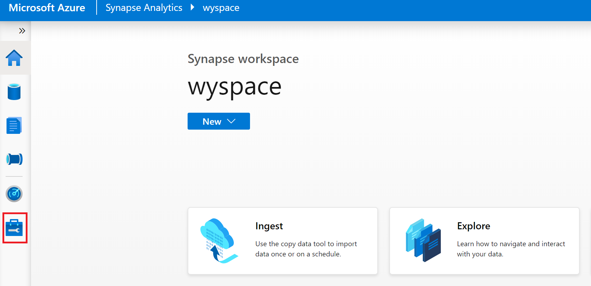

1. Select **Integration runtimes** on the left pane, and then select **+New**.

   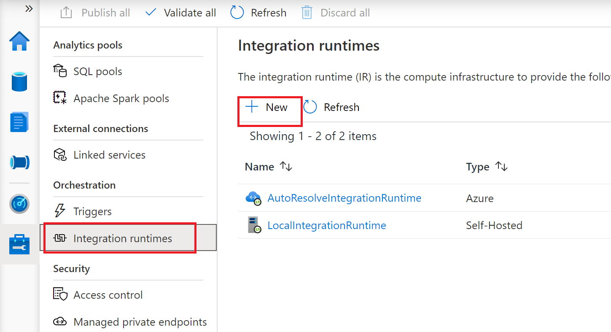

1. On the **Integration runtime setup** page, select **Azure, Self-Hosted**, and then select **Continue**. 

1. On the following page, select **Self-Hosted** to create a Self-Hosted IR, and then select **Continue**.
   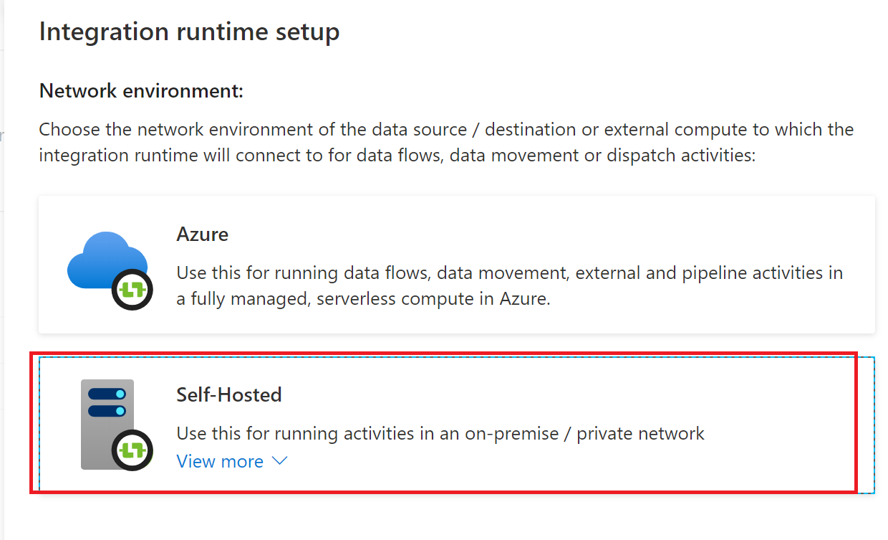

1. Enter a name for your IR as **LocalIntegrationRuntime**, and select **Create**.

1. On the **Integration runtime setup** page, select the link under **Option 1** to open the express setup on your computer. Or follow the steps under **Option 2** to set up manually. The following instructions are based on manual setup:

   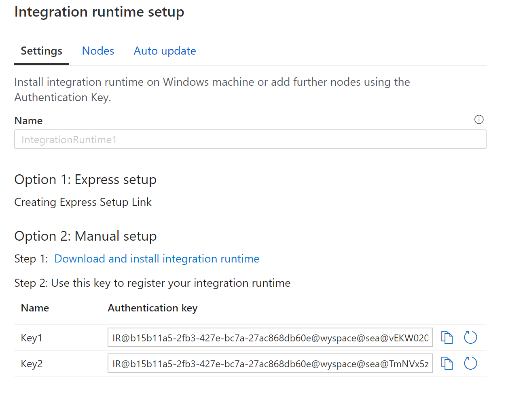

    - Copy and paste the authentication key. Select **Download and install integration runtime** or go the download site at <https://www.microsoft.com/en-sg/download/details.aspx?id=39717> and download the latest version.

    - Download the self-hosted integration runtime on the **SQL Server VM** we created in Exercise 1. Run the installer.

    - On the **Register Integration Runtime (Self-hosted)** page, paste the key you saved earlier, and select **Register**.
    
       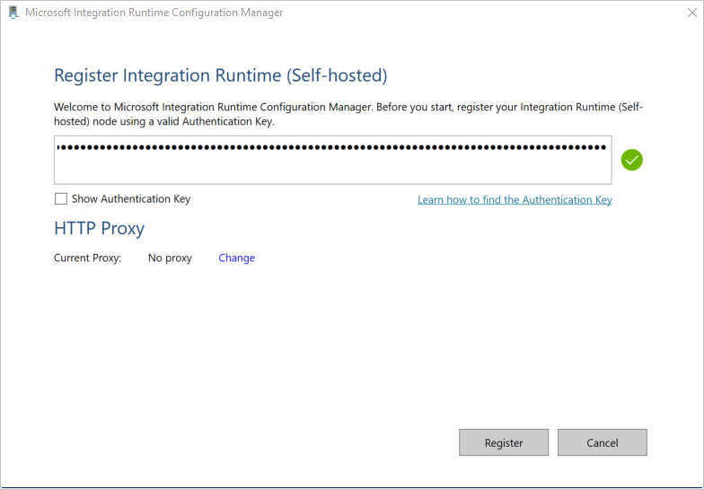

    - On the **New Integration Runtime (Self-hosted) Node** page, select **Finish**.

1. After the self-hosted integration runtime is registered successfully, you see the following window:

    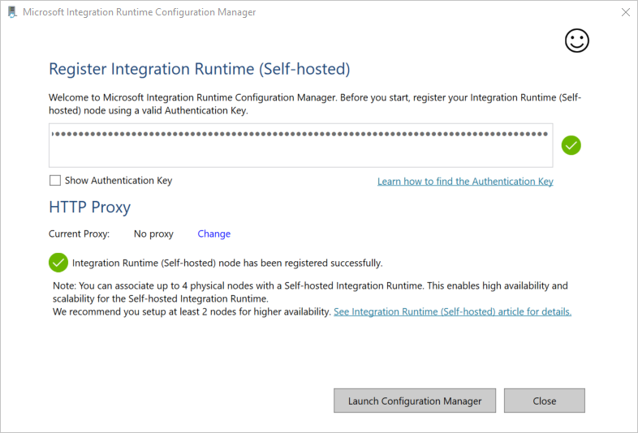

1. Test the connectivity to your SQL Server database by doing the following:

    a. In the **Configuration Manager** window, switch to the **Diagnostics** tab.

    b. In the **Data source type** box, select **SqlServer**.

    c. Enter the server name.

    d. Enter the database name.

    e. Select the authentication mode.

    f. Enter the username.

    g. Enter the password that's associated with the username.

    h. To confirm that integration runtime can connect to the SQL Server, select **Test**.  
    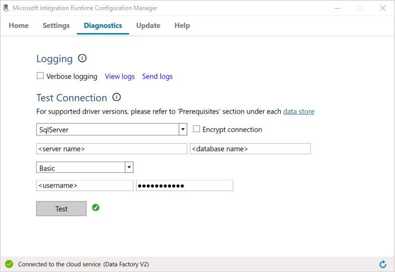

    If the connection is successful, a green checkmark icon is displayed. Otherwise, you'll receive an error message associated with the failure. Fix any issues, and ensure that the integration runtime can connect to your SQL Server instance.

    Note all the preceding values for later use in this tutorial.

## Exercise 2: Setting up Azure Data Lake Storage

Create a contaienr in the existing Azure Data Lake Storage instance to store the **emp** table data.

1. Go to the resource group select the Azure Data Lake Storage instance created earlier **asadatalake<suffix>** and click **Containers****.
    
    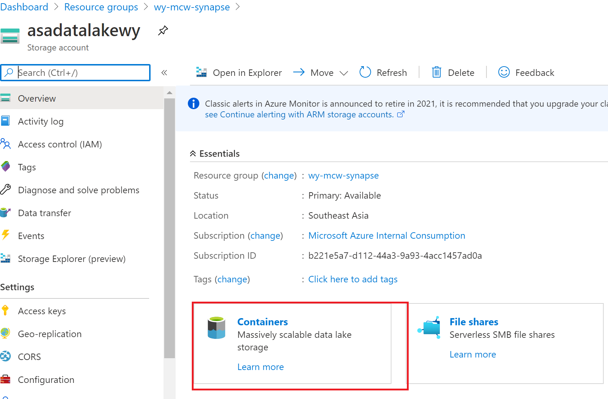

1. In the **Containers** window, select **+ Container** to create a new one.

1. In the **New container** window, under Name, enter **adftutorial**. Then select **Create**.

1. In the list of containers, select **adftutorial** you just created and create another foder **fromonprem** under it.

1. Keep the **container** window for **adftutorial/fromonprem** open. You use it to verify the output at the end of the tutorial. Data Factory automatically creates the output folder in this container, so you don't need to create one.

## Exercise 3: Create Pipeline in Azure Synapse Workspace

1. On the **Let's get started** page, select **Create pipeline**. A pipeline is automatically created for you. You see the pipeline in the tree view, and its editor opens.

   

1. In the General panel under **Properties**, specify **SQLServerToBlobPipeline** for **Name**. Then collapse the panel by clicking the Properties icon in the top-right corner.

1. In the **Activities** tool box, expand **Move & Transform**. Drag and drop the **Copy** activity to the pipeline design surface. Set the name of the activity to **CopySqlServerToAzureBlobActivity**.

1. In the **Properties** window, go to the **Source** tab, and select **+ New**.

1. In the **New Dataset** dialog box, search for **SQL Server**. Select **SQL Server**, and then select **Continue**.
    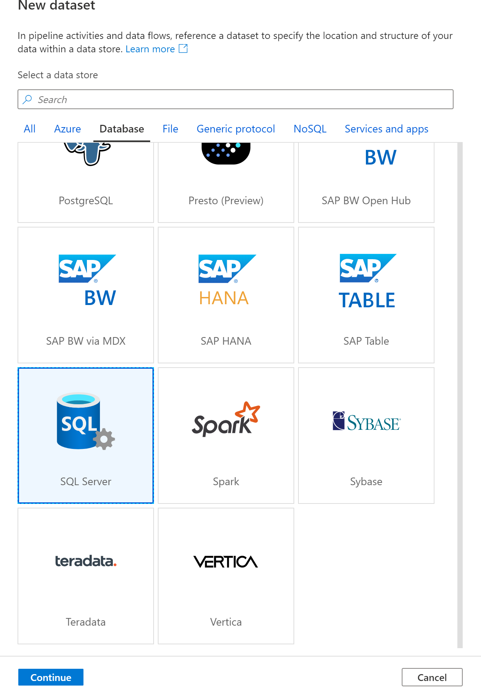

1. In the **Set Properties** dialog box, under **Name**, enter **SqlServerDataset**. Under **Linked service**, select **+ New**. You create a connection to the source data store (SQL Server database) in this step.

1. In the **New linked service (SQL Server)** dialog box, confirm that **LocalIntegrationRuntime** is selected under **Connect via integration runtime**. Then, take the following steps:

    a. Under **Name**, enter **SqlServerLinkedService**.

    b. Under **Server name**, enter the name of your SQL Server instance.

    c. Under **Database name**, enter the name of the database with the **emp** table.

    d. Under **Authentication type**, select the appropriate authentication type that Data Factory should use to connect to your SQL Server database.

    e. Under **User name** and **Password**, enter the user name and password. If you need to use a backslash (\\) in your user account or server name, precede it with the escape character (\\). For example, use *mydomain\\\\myuser*.

    f. Select **Test connection**. This step is to confirm that Data Factory can connect to your SQL Server database by using the self-hosted integration runtime you created.

    g. To save the linked service, select **Create**.
 
    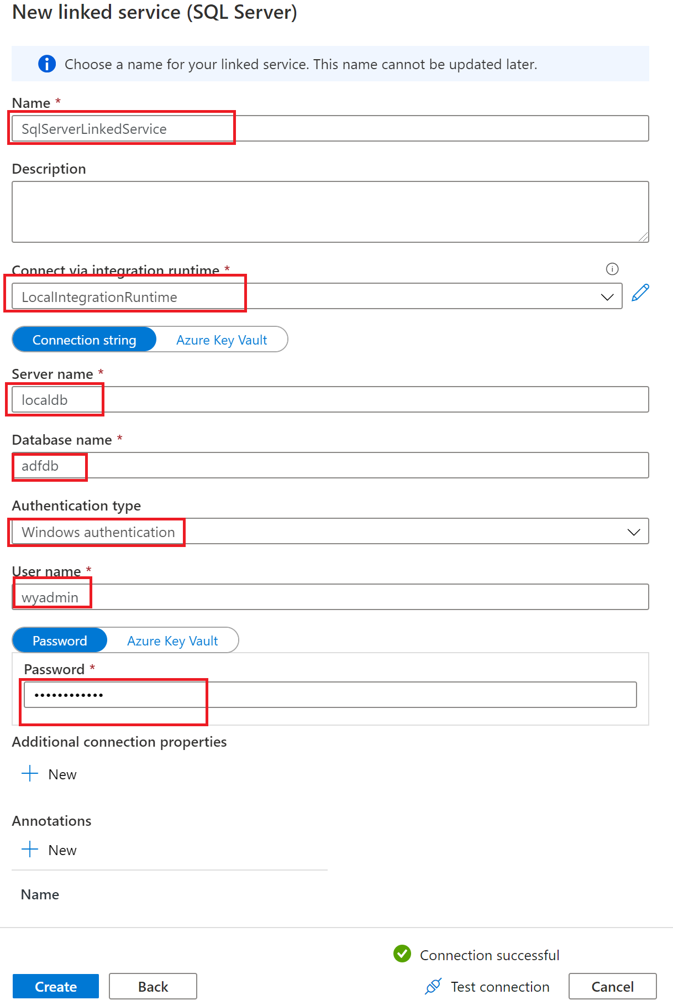

1. After the linked service is created, you're back to the **Set properties** page for the SqlServerDataset. Take the following steps:

    a. In **Linked service**, confirm that you see **SqlServerLinkedService**.

    b. Under **Table name**, select **[dbo].[emp]**.
    
    c. Select **OK**.

1. Go to the tab with **SQLServerToBlobPipeline**, or select **SQLServerToBlobPipeline** in the tree view.

1. Go to the **Sink** tab at the bottom of the **Properties** window, and select **+ New**.

1. In the **New Dataset** dialog box, select **Azure Blob Storage**. Then select **Continue**.

1. In **Select Format** dialog box, choose the format type of your data. Then select **Continue**.

    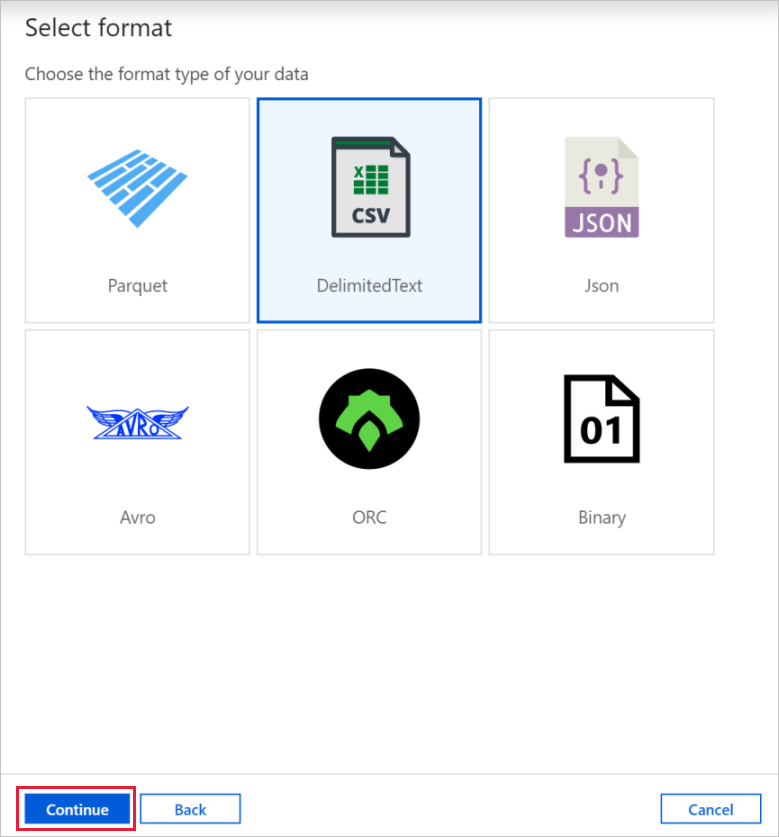

1. In the **Set Properties** dialog box, enter **AzureBlobDataset** for Name. Next to the **Linked service** text box, select **+ New**.

1. In the **New Linked Service (Azure Blob Storage)** dialog box, enter **AzureStorageLinkedService** as name, select your storage account from the **Storage account** name list. Test connection, and then select **Create** to deploy the linked service.

1. After the linked service is created, you're back to the **Set properties** page. Select **OK**.

1. Open the sink dataset. On the **Connection** tab, take the following steps:

    a. In **Linked service**, confirm that **AzureStorageLinkedService** is selected.

    b. In **File path**, enter **adftutorial/fromonprem** for the **Container/ Directory** part.

    c. For the **File** part, leave it empty.

1. Go to the tab with the pipeline opened, or select the pipeline in the tree view. In **Sink Dataset**, confirm that **AzureBlobDataset** is selected.

1. To validate the pipeline settings, select **Validate** on the toolbar for the pipeline. To close the **Pipe validation output**, select the **>>** icon.
    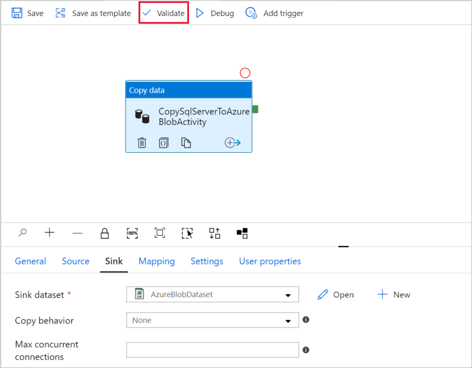
    

1. To publish entities you created to Data Factory, select **Publish all**.

1. Wait until you see the **Publishing completed** pop-up. To check the status of publishing, select the **Show notifications** link on the top of the window. To close the notification window, select **Close**.

1. **Trigger a pipeline run**
Select **Add Trigger** on the toolbar for the pipeline, and then select **Trigger Now**.

1. **Monitor the pipeline run**

    - Go to the **Monitor** tab. You see the pipeline that you manually triggered in the previous step.

    - To view activity runs associated with the pipeline run, select the **SQLServerToBlobPipeline** link under *PIPELINE NAME*. 
        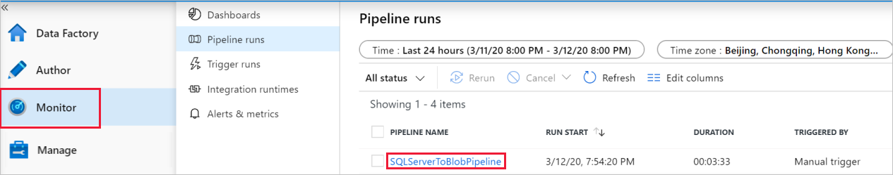

    - On the **Activity runs** page, select the Details (eyeglasses image) link to see details about the copy operation. To go back to the Pipeline Runs view, select **All pipeline runs** at the top.

1. **Verify the output**
The pipeline automatically creates the output folder named *fromonprem* in the `adftutorial` blob container. Confirm that you see the *dbo.emp.txt* file in the output folder.
