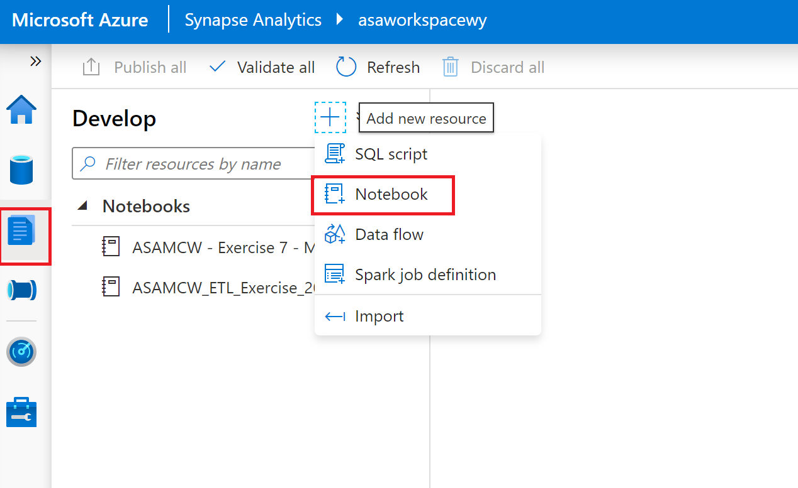

#  Populate the sales data from parquet to sql table using Spark

In the lab **Azure Synapse Analytics and AI hands-on lab step-by-step**, **Exercise 2** has showed how to  create and populate the supporting tables in the SQL Pool.

Now, this lab will demostrate how to perform the similar task using Spark. Here will translate **Exercise 2:Task 1: Create the sale table** to spark practice

## Exercise : Create Notebook



1. Add new notebook and name it as `ASAMCW_ETL_Exercise_2019_Sales`

1. **Add code cell** in the notebook, run the below codes to load the data the first month data in year 2019

    ```scala
    var sales_2019_df =spark.read.parquet("abfss://wwi-02@asadatalakewy.dfs.core.windows.net/sale-small/Year=2019/Quarter=Q1/Month=1/")

    sales_2019_df.createOrReplaceTempView("viewSales2019")
    ```
1. Explore the data 

    ```scala
    display(sales_2019_df.limit(10)) 
    ```

    ```scala
    display(spark.sql("select * from viewSales2019"))
    ```

1. Study the data schema 
    ```scala 
    sales_2019_df.printSchema()
    ```

1. Do the column mapping
    

    ```scala 
    var sqlQuery = s"""Select 
        TransactionId,
        CustomerId,
        ProductId,
        int(Quantity) as Quantity,
        Price,
        TotalAmount,
        TransactionDate as TransactionDateId,
        ProfitAmount,
        int(Hour) as Hour,
        int(Minute) as Minute,
        int (StoreId) as StoreId
    From viewSales2019"""

    var small_sales_df = spark.sql(sqlQuery)
    small_sales_df.cache()
    ```
1. Sink the data to the sql table (this feature is only available in Spark Scala at this momnet).

    ```scala
    small_sales_df.write.sqlanalytics("SQLPool01.wwi_mcw.SaleSmall2019",Constants.INTERNAL)
    ```

1. Verify the result

    ```scala
    val df = spark.read.sqlanalytics("SQLPool01.wwi_mcw.SaleSmall2019") 
    df.show(10)
    ```

## Take to Home
1. Study the table schema created by Spark job ```SQLPool01.wwi_mcw.SaleSmall2019```. Is it good for query performance
2. How to schedule this notebook as a pipeline 
3. Compare it against **Data Flow** solution and think of the using scenarios